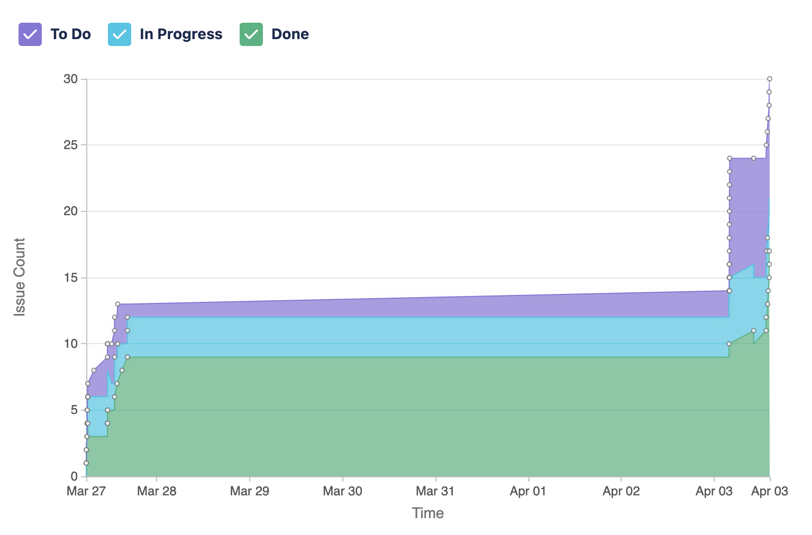

# QClicker – Courses made easier

INTRODUCTION :

-	This website is designed to implement a classroom polling system. It consists of two main components: the iclicker software that is run by the instructor and the iclicker mobile and devices to interact with the instructor. This clicker system enables the instructor to release multiple-choice and short-answer questions and student can submit their answers using their devices which are transmitted to the software. The instructor can grade the results in real time and display them on the devices used by students. The iClicker system also allows the instructor to keep a track of attendance.
To conclude , this website allows for real-time interaction between the student and the instructor which results in interactive discussions and participation.

-	We have currently created a QClicker website which shows a home page as soon as it opens. 
-	It gives us the option of creating an account or logging in (as an instructor or a student ). By creating an iClicker account as an instructor, it enables us to create course which will be using the iClicker software. By creating an iClicker account as a student , it enables us to enroll into courses that are required according to the course schedule. 
-	By logging in as an instructor , it enables us to start the class by entering the course to be started for students to join and eventually start the polling system.
-	By logging in as a student,  it enables us to join the class/ course and then we can enter the desired course started by the instructor and start with real-time participation.
Methodology :
For the construction of the website, we implement the use of Apache Web server and PHP. We manage the database with phpadmin while the server side requests are handled by Apache Web Server hosted on the local computer. For this, the server was hosted on one of the participants and we all worked on it there.

We ran several test cases to verify whether the desire output was displayed or not. These can be categorised into three main categories:

* Test For Functionality:  We test whether the forms are functioning   correctly. We ccheck whether the forums are submitted correctly and that the information is being added to the databases.


* Test for Invalid Input: We test the forums by adding invalid inputs like empty fields, wrong datatypes, etc. The forums then should not submit and show an error message.

*	Test for Usability :  We then test the forums for their usability.  We ensure the forums are easy to use. We verify that the error messages are easily understandable.

LEARNING/UNDERSTANDING :

This project the team to work collaboratively under a given timeframe and learn different skills while working on their own tasks and passing on the knowledge to their fellow team mates. While working on the project , we observed the importance of class diagrams and data flow diagrams in understanding the proper working of the website. These diagrams made us understand the proper running and sequence of features to be added gradually for the success of the polling. Using these diagrams , we made sequence diagram for the website to understand the dynamic model of the website and get a proper sense of the runtime of the website with all the modifications being made. The sequence diagrams experienced changes throughout the development of the website as the team members kept on upgrading the website with more and new features.

-	Our main goal was to implement the Qclicker system using PHP , HTML(Hypertext Markup Language) and CSS( Cascading Style Sheets) for the front end development of the website and to make it user-friendly and interactive. We made full use of the GitHub platform for the team to work collaboratively and at their pace if needed to update the features.
-	We have tried to make the website to fill in the gap between the students and the instructors so that there is continuous interaction between the two entities. 

CHALLENGES :

One of the main challenges that the team faced was the time constraint that put us in a tough spot and therefore we had to pick up a slower pace so that a thorough testing is done for every step before proceeding to the next one. We made a decision as a team to move forward with a better planning so that every feature and implementation gets equally divided time and efforts.

COMPLETED FEATURES :
1.	Made a dashboard for the student 
2.	Made a dashboard for the instructor
3.	Login/Create account page for the student 
4.	Login/Create account page for the instructor
5.	Student (after logging in) can view their courses
6.	Students can join their courses , and look at their attendance and statistics (performance in the class)
7.	Instructors (after logging in) can view their courses
8.	Instructors can add new courses

FEATURES IN PROGRESS :
-	Instructor Overview 
1.	Instructors (after logging in) can start the class
2.	Instructors can start the poll
3.	Instructors can grade the results
4.	 Instructors can display the polling statistics 

CONCLUSION / RESULTS :

-	To conclude , we have reached a point where we have completed the following features :
1.	Student login option 
2.	Student creating a new iClicker account.
3.	Instructor login option
4.	Instructor creating a new iClicker account.
5.	Created a dashboard for both instructor and student after logging in/creating a new account.
6.	Created the option of joining courses for the student.
7.	Created the option of starting the course for the instructor.
8.	Created the test runs for various features to verify if we get the desired result.
-	While implementing the above features, we came across various new and creative options to be added to the website which will be added to the website eventually as some of them are in progress while others must be started.
-	In the coming week,  we plan to have a look at the challenges faced by the team and the features in progress so that everything can be implemented with proper testing , so that we do not encounter the same difficulties.
-	In totality, it has been a great experience for the whole team to be working together using different platforms and upgrading the website. We got a better understanding of teamwork and project management. We are looking forward to consider any sort of feedback so that we can satisfy the user’s requirements.

